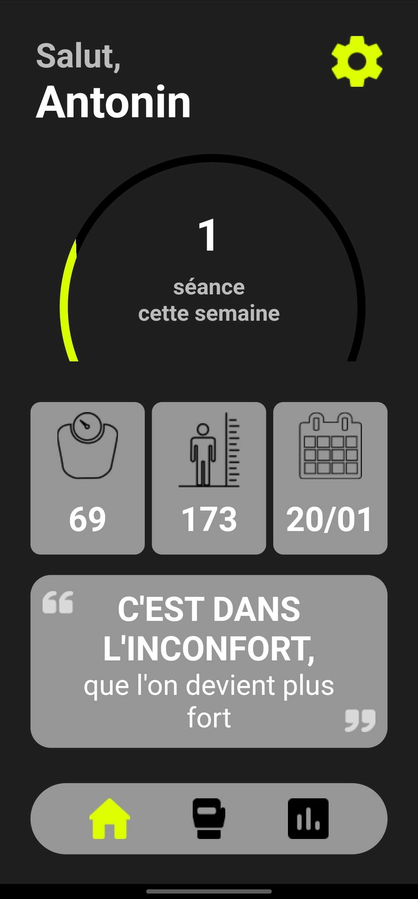
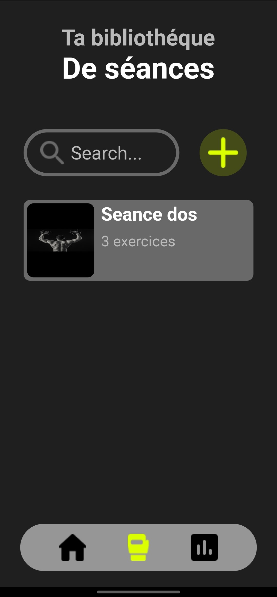

# Application de sport

Cette application de sport permets à l'utilisateur d'enregistrer ses différentes séances afin de 
pouvoir suivre ses performances. 

## Fonctionnalitées :
- Suivre son objectif de nombre de séances par semaine 
- Enregister différentes séances avec des exercices
- Enregistrer le poids actuel sur un exercice
- Ajouter des exercices aux favoris
- Supprimer une séance créée

## Futures fonctionnalitées :
- Affichage des exercices favoris
- Graphiques de progression pour les exercices favoris
- Supprimer un exercice dans une séance

## Images de l'application : 

## Langages utilisés : 
- Dart
- Flutter